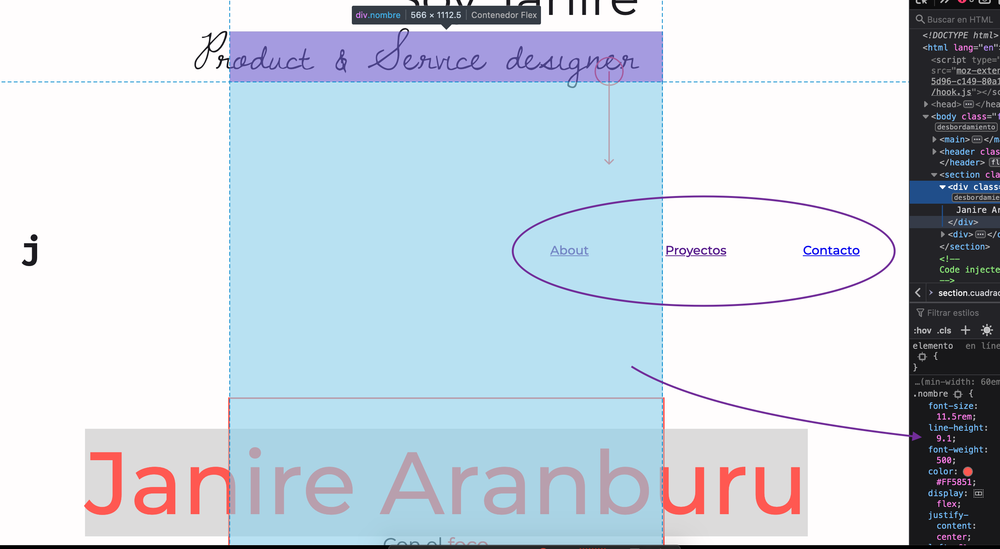

# Review final

En general veo que has conseguido muchas cosas que proponías en tu diseño. Hay cosas a mejorar, pero para empezar lo veo bastante bien. Te añado algo de feedback en cuanto al código y mejoras de alguna solución.

El idioma de tu página está en español, por lo que el código de la página debería reflejarlo


La cabecera en móvil queda desplazada y no termina de leerse bien la palabra principal


En la home, tienes algún elemento que está empujando el layout y generando un scroll horizontal


Hay varias páginas en las que estás utilizando `padding` para centrar el contenido. De preferencia, es mejor darle un ancho máximo y que el contenido se contenga dentro de ese espacio. Es mucho mejor para controlar el tamaño y el responsive, de lo contrario te suelen quedar columnas muy angostas.


```
.wrapper {
    margin: 0 auto;
    max-width: 37rem;
    width: 100%;
}
```

De esta manera controlas el ancho máximo, pero no varía en dispositivos, hasta que la pantalla mida, en este ejemplo, menos de `37rem`.

Ten cuidado con estilar utilizando `line-height`, esto hace que los elementos ocupen espacio aunque no se vea, y pueden perjudicar en la usabilidad. En este caso, este elemento me estaba bloqueando los links y no podía acceder a todas las páginas de la web



Revisa algunos elementos semánticos de tu HTML, en el siguiente caso es más recomendable utilizar ul y li, ya que es más un listado que párrafos. Y en el último deberías utilizar `<h2>` ya que es un subtítulo de la página.


En el caso de los billboards, intenta añadir texto encima de la imagen, eso facilita a que puedas añadir un elemento `<h1>` que son necesarios e importantes, tanto para accesibilidad como SEO.

En este último caso, puedes simplificar el uso de la clase `separacion-descripcion`, puedes añadir espacios en dependencia de la relación de elemento:

```
p + p {
    margin-top: 1.5rem;
}
```

Con esto le estás indicando que el elemento `<p>` que va seguido de otro elemento `<p>` tenga un margen superior. Ten en cuenta que en estos casos el estilo se aplica siempre al elemento que está después del `+`, no hay manera de aplicarlo al anterior.

En el caso del `alt` de las imágenes, recuerda añadir una información descriptiva solo en caso que la imagen sea relevante y que explique algo que no esté explicitado en el texto. Por ejemplo, en el siguiente caso, podrías añadir algún texto que indique que es un enlace a un proyecto concreto, ya que no tiene texto de apoyo


Veo también que has optimizado las imágenes, lo cual está genial para la velocidad, pero alguna se ha quedado con el tamaño grande, como tu foto de perfil, que pesa 4MB.

En la página de contacto, puedes mejorar los elementos de contacto, tanto en HTML como UX. Es importante que permitas a los usuarios acceder facilmente a contactarte o ver tu información.


